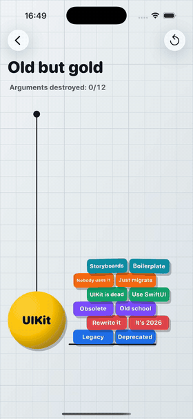

# DynamicsShowcase



**Everything UIKit Dynamics can do, in one app.** UIKit has shipped with a 2D physics engine since iOS 7 — `UIDynamicAnimator` — and almost nobody uses it. This project puts every behavior it has on screen: gravity, collisions, snaps, attachments, pushes, all ten force fields, and a few things the API doesn't offer out of the box (a rope that goes slack, a hit-stop, orbits on real inverse-square gravity).

Every item on every screen is a plain `UIView`. No SpriteKit, no game engine, no dependencies, no assets — everything is drawn in code.

It is meant to be read as much as run: each screen's view controller opens with a comment on the part of the API it demonstrates, and the pitfalls found along the way are collected [below](#uikit-dynamics-gotchas-encoded-in-this-project).

## Running

Open `DynamicsShowcase.xcodeproj` in Xcode → Run (⌘R). iOS 16+.

To jump straight to a screen, set the `AUTO_OPEN_DEMO` environment variable to `0…7` in the scheme — the app opens that demo on launch.

<br clear="right">

## Screens and API coverage

| Screen | API |
|---|---|
| 🍎 Gravity | `UIGravityBehavior` (vector steered by finger, `magnitude` slider down to a zero-g freeze), `UICollisionBehavior` + `translatesReferenceBoundsIntoBoundary`, `UICollisionBehaviorDelegate` (flashes + haptics), elliptical collision bounds (`collisionBoundsType = .ellipse`) |
| 🧲 Snap | `UISnapBehavior` with adjustable `damping` |
| 🏗️ Old but gold (wrecking ball) | `UIAttachmentBehavior` and a custom `UIDynamicBehavior`. A dense "UIKit" ball hangs on a real rope — `RopeBehavior`: slack it does nothing, stretched it is a damped spring; drawn as a sagging Verlet chain — and smashes a wall of bricks reading "UIKit is dead", "Use SwiftUI", "Legacy"… Drag it on a springy attachment (pull past the rope's reach and it slings back) or flick to throw. A hard hit shatters a brick into snapshot shards, sends out a shockwave, shakes the screen and freezes the scene for a beat (hit-stop). A cleared wall drops a payoff line in on a `UISnapBehavior` and is rebuilt with a fresh draw of words |
| 🎱 Push Impulses | `UIPushBehavior` — `.instantaneous` (billiards-style slingshot: force = pull distance, spin via `setTargetOffsetFromCenter`) and `.continuous` with a rotating vector; a white cue ball, six pockets that pot the balls, a cleared table respawns the rack; the "Real UI" mode swaps the rack for a live settings screen (labels, cards, a working `UISwitch`, buttons): every cell hangs on a spring (`UIAttachmentBehavior` with `frequency`/`damping`), weighs in proportion to its area, squashes on contact and shatters into snapshot shards under a hard hit |
| 🌀 Force Fields | `UIFieldBehavior` — all 10 types: radial, spring, vortex, noise, turbulence, velocity, linear, drag, electric, magnetic (charge via `UIDynamicItemBehavior.charge`), `UIRegion` |
| 🪐 Solar System | `radialGravityField(falloff: 2)` — a true inverse-square gravity well; planets on calibrated circular orbits (`linearVelocity(for:)`, `updateItem(usingCurrentState:)`) |
| ⚖️ Body Properties | `UIDynamicItemBehavior` — `elasticity`, `density`, `resistance` compared side by side, a floor boundary via `addBoundary(withIdentifier:from:to:)` |
| 🎉 Paywall Drop | any `UIView` is a dynamic item: a realistic paywall falls off the screen under gravity on "Continue" (`addLinearVelocity` scatter), a `UISnapBehavior` greeting slowed by `resistance`, `CAEmitterLayer` confetti |

## Architecture

Lightweight MVVM, adapted to the nature of UIKit Dynamics. The physics engine animates *views* directly, so the view controllers own the animator and the behaviors — hiding that behind bindings would only obscure the API this project exists to demonstrate. Everything else is pulled out of the controllers:

- **View models** (one per screen) hold the scene configuration (tuning constants, texts) and all the pure math — layout geometry, impulse conversion, target points. They never touch views, behaviors or the animator, so they are trivially unit-testable. The clearest example is `SolarSystemDemoViewModel`, which turns the field's calibrated strength into circular-orbit velocities.
- **Views** (`BallView`, `BoxView`, `DemoCardCell`, …) only draw themselves.
- **View controllers** wire gestures to view-model math and feed the results into UIKit Dynamics behaviors. Each controller's doc comment explains which part of the API the screen demonstrates.
- `DemoCatalog` is the single model of the demo list; `MenuViewModel` serves it to the menu.

```
DynamicsShowcase/
├── App/                    AppDelegate, SceneDelegate
├── Core/                   Theme, Haptics, item views, shared geometry helpers,
│                           DemoViewController (base class: gradient background,
│                           animator, reset button, collision response)
├── Menu/                   DemoCatalog (model), MenuViewModel, MenuViewController, DemoCardCell
└── Demos/
    ├── Gravity/            GravityDemoViewModel + ViewController
    ├── Snap/               SnapDemoViewModel + ViewController
    ├── WreckingBall/       WreckingBallDemoViewModel (wall geometry, tuning) + ViewController, RopeBehavior, VerletRope
    ├── Push/               PushDemoViewModel + ViewController
    ├── Fields/             FieldCatalog (FieldKind + FieldFactory), FieldsDemoViewModel + ViewController
    ├── SolarSystem/        SolarSystemDemoViewModel (orbital math) + ViewController
    ├── Properties/         PropertiesDemoViewModel + ViewController
    └── Paywall/            PaywallDemoViewModel + ViewController
```

### UIKit Dynamics gotchas encoded in this project

- A `UIFieldBehavior` affects only items explicitly added to it with `addItem(_:)` — adding the behavior to the animator is not enough.
- With `translatesReferenceBoundsIntoBoundary`, an item spawned outside the reference view lands *on top of* the boundary instead of entering the screen — always spawn inside the bounds.
- Behaviors keep referencing their items after the views are removed; on every scene reset the behaviors are created fresh (`buildScene()`).
- Members of a `UIDynamicItemGroup` must not be given individual behaviors — the group is the dynamic item.
- A `UIAttachmentBehavior` is a rod or a two-way spring, never a rope: it resists compression as much as stretching, so above the anchor it props the item up instead of letting it fall. A rope that goes slack takes a custom behavior: `RopeBehavior` checks the distance in its `action` block on every animator step and, only while the rope is stretched, applies a damped-spring pull as a velocity change (`addLinearVelocity(_:for:)`) — an acceleration, so it needs no knowledge of the item's mass.
- Rigid attachments are still stiff springs inside the solver, and links in series add up their compliance: a heavy ball on a chain of small links gets squeezed off its arc when it plows into a pile. One attachment straight to the anchor holds.
- An attachment to the finger doesn't make a throw. A rigid one brings the item to a halt if the finger stops for even one frame; a springy one trails the finger, and a short flick is over before the spring has passed its speed on. Throw explicitly: on release, hand the item the pan's velocity with `addLinearVelocity(_:for:)`.
- A layer shadow with an offset is cast in the layer's own coordinates, so it swings around a rotating item. For a hard shadow that always falls the same way, add a shadow sublayer (`zPosition = -1`) and slide it against the rotation whenever `layer.transform` changes (KVO). A separate shadow layer synced from a display link or a behavior's `action` trails a fast item by a frame. A view's `backgroundColor` draws beneath every sublayer, so the item's face has to be a sublayer too.
- The animator has no time scale, so a hit-stop (the scene standing still for a beat on a heavy impact) is done by hand: remember every item's linear and angular velocity, cancel them with `addLinearVelocity`/`addAngularVelocity`, zero the gravity, and give it all back ~0.1 s later. Zero gravity through `gravityDirection`, and restore it the same way — a zero vector has no angle, so setting `magnitude` back on its own points gravity sideways.
- `UIGravityBehavior`'s default magnitude (1000 pt/s²) suits small items. A big scene — a 120 pt ball on a 425 pt rope — falls and swings in slow motion under it; scale `magnitude` with the scene. And keep `resistance` off debris: it reads as flying through water.
- Contact friction combines both items' `friction`: a slick ball (`friction = 0`) sheds the bricks that land on it, whatever their own friction.
- An item can have only one active `UISnapBehavior`; replace, don't stack.

## License

MIT — see [LICENSE](LICENSE).
