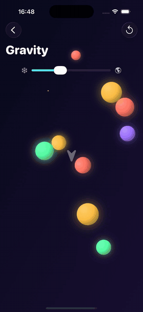
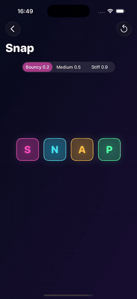
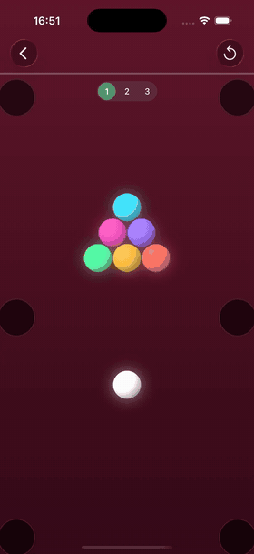
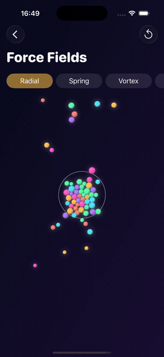
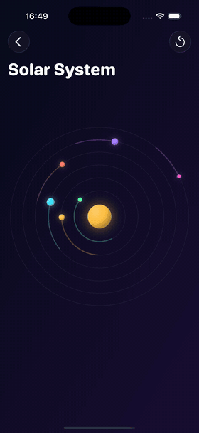
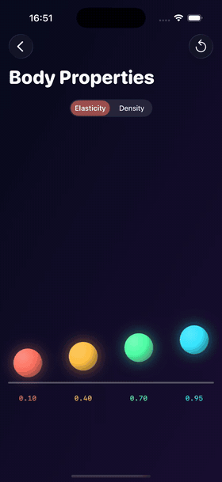

# DynamicsShowcase


**Everything UIKit Dynamics can do, in one app.** UIKit has shipped with a 2D physics engine since iOS 7 — `UIDynamicAnimator` — and almost nobody uses it. This project puts every behavior it has on screen: gravity, collisions, snaps, attachments, pushes, all ten force fields, and a few things the API doesn't offer out of the box (a rope that goes slack, a hit-stop, orbits on real inverse-square gravity).

Every item on every screen is a plain `UIView`. No SpriteKit, no game engine, no dependencies, no assets — everything is drawn in code.

It is meant to be read as much as run: each screen's view controller opens with a comment on the part of the API it demonstrates.

## Running

Open `DynamicsShowcase.xcodeproj` in Xcode → Run (⌘R). iOS 15+.

To jump straight to a screen, set the `AUTO_OPEN_DEMO` environment variable to `0…7` in the scheme — the app opens that demo on launch.

<br clear="right">

## Screens

[🍎 Gravity](#gravity) · [🧲 Snap](#snap) · [🏗️ Old but gold](#old-but-gold) · [🎱 Push Impulses](#push-impulses) · [🌀 Force Fields](#force-fields) · [🪐 Solar System](#solar-system) · [⚖️ Body Properties](#body-properties) · [🎉 Paywall Drop](#paywall-drop)

### Gravity



`UIGravityBehavior` (vector steered by finger, `magnitude` slider down to a zero-g freeze), `UICollisionBehavior` + `translatesReferenceBoundsIntoBoundary`, `UICollisionBehaviorDelegate` (flashes + haptics), elliptical collision bounds (`collisionBoundsType = .ellipse`).

Code: [`Demos/Gravity/`](DynamicsShowcase/Demos/Gravity)

<br clear="right">

### Snap



`UISnapBehavior` with adjustable `damping`.

Code: [`Demos/Snap/`](DynamicsShowcase/Demos/Snap)

<br clear="right">

### Old but gold


`UIAttachmentBehavior` and a custom `UIDynamicBehavior`. A dense "UIKit" ball hangs on a real rope — `RopeBehavior`: slack it does nothing, stretched it is a damped spring; drawn as a sagging Verlet chain — and smashes a wall of bricks reading "UIKit is dead", "Use SwiftUI", "Legacy"… Drag it on a springy attachment (pull past the rope's reach and it slings back) or flick to throw. A hard hit shatters a brick into snapshot shards, sends out a shockwave, shakes the screen and freezes the scene for a beat (hit-stop). A cleared wall drops a payoff line in on a `UISnapBehavior` and is rebuilt with a fresh draw of words.

Code: [`Demos/WreckingBall/`](DynamicsShowcase/Demos/WreckingBall) — the wrecking ball

<br clear="right">

### Push Impulses



`UIPushBehavior` — `.instantaneous` (billiards-style slingshot: force = pull distance, spin via `setTargetOffsetFromCenter`) and `.continuous` with a rotating vector; a white cue ball, six pockets that pot the balls, a cleared table respawns the rack; the "Real UI" mode swaps the rack for a live settings screen (labels, cards, a working `UISwitch`, buttons): every cell hangs on a spring (`UIAttachmentBehavior` with `frequency`/`damping`), weighs in proportion to its area, squashes on contact and shatters into snapshot shards under a hard hit.

Code: [`Demos/Push/`](DynamicsShowcase/Demos/Push)

<br clear="right">

### Force Fields



`UIFieldBehavior` — all 10 types: radial, spring, vortex, noise, turbulence, velocity, linear, drag, electric, magnetic (charge via `UIDynamicItemBehavior.charge`), `UIRegion`.

Code: [`Demos/Fields/`](DynamicsShowcase/Demos/Fields)

<br clear="right">

### Solar System



`radialGravityField(falloff: 2)` — a true inverse-square gravity well; planets on calibrated circular orbits (`linearVelocity(for:)`, `updateItem(usingCurrentState:)`).

Code: [`Demos/SolarSystem/`](DynamicsShowcase/Demos/SolarSystem)

<br clear="right">

### Body Properties



`UIDynamicItemBehavior` — `elasticity`, `density`, `resistance` compared side by side, a floor boundary via `addBoundary(withIdentifier:from:to:)`.

Code: [`Demos/Properties/`](DynamicsShowcase/Demos/Properties)

<br clear="right">

### Paywall Drop


any `UIView` is a dynamic item: a realistic paywall falls off the screen under gravity on "Continue" (`addLinearVelocity` scatter), a `UISnapBehavior` greeting slowed by `resistance`, `CAEmitterLayer` confetti.

Code: [`Demos/Paywall/`](DynamicsShowcase/Demos/Paywall)

<br clear="right">

## Architecture

Lightweight MVVM, adapted to the nature of UIKit Dynamics. The physics engine animates *views* directly, so the view controllers own the animator and the behaviors — hiding that behind bindings would only obscure the API this project exists to demonstrate. Everything else is pulled out of the controllers:

- **View models** (one per screen) hold the scene configuration (tuning constants, texts) and all the pure math — layout geometry, impulse conversion, target points. They never touch views, behaviors or the animator, so they are trivially unit-testable. The clearest example is `SolarSystemDemoViewModel`, which turns the field's calibrated strength into circular-orbit velocities.
- **Views** (`BallView`, `BoxView`, `DemoCardCell`, …) only draw themselves.
- **View controllers** wire gestures to view-model math and feed the results into UIKit Dynamics behaviors. Each controller's doc comment explains which part of the API the screen demonstrates.
- `DemoCatalog` is the single model of the demo list; `MenuViewModel` serves it to the menu.

```
DynamicsShowcase/
├── App/                    AppDelegate, SceneDelegate
├── Core/                   Theme, Haptics, item views, shared geometry helpers,
│                           DemoViewController (base class: gradient background,
│                           animator, reset button, collision response)
├── Menu/                   DemoCatalog (model), MenuViewModel, MenuViewController, DemoCardCell
└── Demos/
    ├── Gravity/            GravityDemoViewModel + ViewController
    ├── Snap/               SnapDemoViewModel + ViewController
    ├── WreckingBall/       WreckingBallDemoViewModel (wall geometry, tuning) + ViewController, RopeBehavior, VerletRope
    ├── Push/               PushDemoViewModel + ViewController
    ├── Fields/             FieldCatalog (FieldKind + FieldFactory), FieldsDemoViewModel + ViewController
    ├── SolarSystem/        SolarSystemDemoViewModel (orbital math) + ViewController
    ├── Properties/         PropertiesDemoViewModel + ViewController
    └── Paywall/            PaywallDemoViewModel + ViewController
```

## License

MIT — see [LICENSE](LICENSE).
